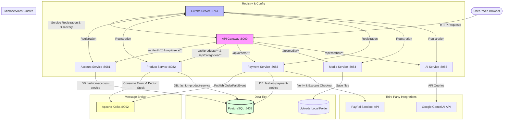

# 🛍️ Modern Microservices Fashion E-Commerce Platform

A production-ready, highly scalable, and modular **Fashion E-Commerce Platform** built using a microservices architecture. It features a modern, interactive single-page frontend, a distributed and secure backend registry, event-driven communications, PayPal sandbox payment integration, and a state-of-the-art AI-powered fashion stylist assistant powered by the Google Gemini API.

---

## 🚀 Tech Stack Badges

### Frontend Stack


### Backend & Registry Stack


### Databases & Event Broker


### Third-Party & Infrastructure


---

## 🗺️ System Architecture

This project is built around **Microservice Design Patterns** including service registry and discovery, an API gateway as the single-entry point, distributed database-per-service patterns, and async event choreography via Apache Kafka.



---

## 🛠️ Project Structure & Microservices

The repository is organized into distinct directories for individual services:

*   **[`eureka-server/`](file:///d:/ecommerce-fashion-website/eureka-server)**: The service registry where all microservices register themselves, enabling dynamic load-balancing and configuration lookup.
*   **[`api-gateway/`](file:///d:/ecommerce-fashion-website/api-gateway)**: The single gateway acting as a reverse-proxy routing requests downstream to active registry instances using Spring Cloud Gateway. It handles centralized JWT verification.
*   **[`account-service/`](file:///d:/ecommerce-fashion-website/account-service)**: Manages customer accounts, roles, profiles, secure authentication, password encryption, and automated email validation/notifications.
*   **[`product-service/`](file:///d:/ecommerce-fashion-website/product-service)**: Holds product catalogs, category structures, inventories, and images. Automatically updates inventory using Kafka order payment topics. Manages database migrations via Flyway.
*   **[`payment-service/`](file:///d:/ecommerce-fashion-website/payment-service)**: Coordinates placing orders, creating transaction records, and verifying checkouts with the external PayPal API. Triggers the inventory deduction event on a successful checkout.
*   **[`media-service/`](file:///d:/ecommerce-fashion-website/media-service)**: Handles visual asset storage. Facilitates uploading pictures for product items and profiles, serving them back static via local volume mounts.
*   **[`ai-service/`](file:///d:/ecommerce-fashion-website/ai-service)**: Exposes a chatbot advisor endpoint. Integrates Google Gemini API to analyze current trends and supply conversational styling guidance.
*   **[`frontend-service/`](file:///d:/ecommerce-fashion-website/frontend-service)**: React-based single page web app using Vite, utilizing Tailwind CSS for sleek utility layout styling and Material UI (MUI) components.
*   **[`docker/`](file:///d:/ecommerce-fashion-website/docker)**: Contains infrastructure config scripts, primarily the PostgreSQL database initialization.

---

## ⚙️ Configuration Setup

Configure credentials inside the root **[`.env`](file:///d:/ecommerce-fashion-website/.env)** file. Key parameters include:

| Variable | Description | Example / Recommended Value |
| :--- | :--- | :--- |
| `JWT_SECRET` | Base64 secret key for encoding and validating auth tokens | *Secure long random string* |
| `POSTGRES_USER` | Admin user for the database instance | `app_user` |
| `POSTGRES_PASSWORD`| Admin password for the database instance | `123456` |
| `EMAIL_USERNAME` | SMTP Google email address for authentication mailer | `your-email@gmail.com` |
| `EMAIL_PASSWORD` | App-specific token generated from Google Account | `xxxx xxxx xxxx xxxx` |
| `PAYPAL_CLIENT_ID` | Sandbox Application Client ID from PayPal developer console| `AZHUN6GO8x08aEMFgFK...` |
| `PAYPAL_CLIENT_SECRET`| Sandbox Application Secret from PayPal developer console | `EOwM1OcMkw6j0oAKdwu...` |
| `GEMINI_API_KEY` | API Key generated from Google AI Studio | `AIzaSyA...` |

---

## 🏃 How to Run the Project

### Method 1: Orchestration via Docker Compose (Recommended)

Ensure you have **Docker Desktop** installed and running.

1.  Open your terminal in the root directory:
    ```bash
    docker compose up -d --build
    ```
2.  Docker will download base images, construct local service images, spin up network interfaces, and run services in order.
3.  Monitor active logs to verify all backends boot:
    ```bash
    docker compose logs -f
    ```
4.  To tear down and remove persistent container data:
    ```bash
    docker compose down -v
    ```

---

### Method 2: Running Locally for Development

To debug individual microservices, run them locally from your IDE or CLI.

#### 📋 Prerequisites
*   **Java 21 JDK** installed (`java -version`).
*   **Node.js 18+** & **npm** installed (`node -v`).
*   A running **PostgreSQL** instance on port `5433` (or update `.env` to point to a local DB).
*   A running **Apache Kafka** instance on port `9092`.

> [!NOTE]
> You can spin up *just* the PostgreSQL database and Apache Kafka broker using Docker to save local installation trouble:
> ```bash
> docker compose up -d postgres kafka
> ```

#### 📂 Database Setup
If using a custom PostgreSQL install, run [**`docker/postgres/init.sql`**](file:///d:/ecommerce-fashion-website/docker/postgres/init.sql) to set up databases:
```sql
CREATE DATABASE "fashion-account-service";
CREATE DATABASE "fashion-product-service";
CREATE DATABASE "fashion-payment-service";
```

#### 🖥️ Step-by-Step Backend Launch Order
Run each command in its respective sub-directory:

1.  **Eureka Discovery Service**
    ```bash
    cd eureka-server
    ./mvnw spring-boot:run
    ```
2.  **Spring Cloud Gateway**
    ```bash
    cd api-gateway
    ./mvnw spring-boot:run
    ```
3.  **Account Service**
    ```bash
    cd account-service
    ./mvnw spring-boot:run
    ```
4.  **Product Service**
    ```bash
    cd product-service
    ./mvnw spring-boot:run
    ```
5.  **Payment Service**
    ```bash
    cd payment-service
    ./mvnw spring-boot:run
    ```
6.  **Media Upload Service**
    ```bash
    cd media-service
    ./mvnw spring-boot:run
    ```
7.  **AI Service**
    ```bash
    cd ai-service
    ./mvnw spring-boot:run
    ```

#### 🌐 Launching the React Frontend
Navigate to the frontend folder, install dependencies, and run the Vite server:
```bash
cd frontend-service
npm install
npm run dev
```

---

## 🔌 Port Mapping Registry

Once started, the following local ports are registered and exposed:

| Service Name | Port | Description / Endpoint |
| :--- | :--- | :--- |
| **Frontend Web App** | `5173` | http://localhost:5173 |
| **API Gateway** | `8000` | http://localhost:8000 |
| **Eureka Server Dashboard**| `8761` | http://localhost:8761 |
| **Account Service** | `8081` | http://localhost:8081 |
| **Product Service** | `8082` | http://localhost:8082 |
| **Payment Service** | `8083` | http://localhost:8083 |
| **Media Service** | `8084` | http://localhost:8084 |
| **AI chatbot Service** | `8085` | http://localhost:8085 |
| **PostgreSQL Database** | `5433` | Host interface port (maps to container `5432`) |
| **Apache Kafka Broker** | `9092` | Internal listener port |

---

## 🚦 API Gateway Routing Schema

The Gateway forwards client requests matching these routing predicates:

*   **`/api/auth/**`** ➔ `Account-Service` (Sign-in, Register, Token operations)
*   **`/api/users/**`** ➔ `Account-Service` (User profile views, updates)
*   **`/api/products/**`** ➔ `Product-Service` (Browsing & inventory management)
*   **`/api/categories/**`** ➔ `Product-Service` (Managing collections)
*   **`/api/orders/**`** ➔ `Payment-Service` (Order workflows, PayPal checkouts)
*   **`/api/media/**`** ➔ `Media-Service` (Static image files upload/download)
*   **`/api/chatbot/**`** ➔ `AI-Service` (Gemini styling dialogues)
