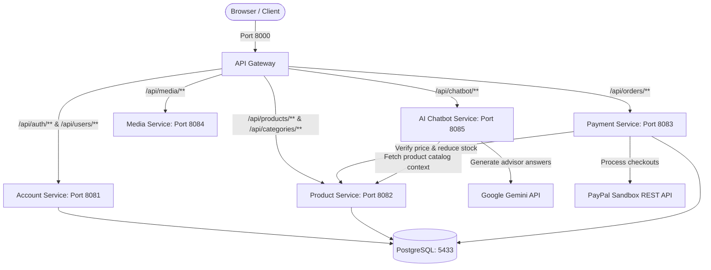

# Ecommerce Fashion Website - System Summary

This document provides a comprehensive overview of the microservice architecture, tech stack, network configurations, database structure, and integration details of the Ecommerce Fashion Website.

---

## 1. System Architecture Diagram



---

## 2. Microservice Directory & Ports

| Service Name | Port | Database | Primary Purpose / Features |
|:---|:---:|:---|:---|
| **`api-gateway`** | `8000` | None | Main entry point, request routing, header filter, public path permits mapping. |
| **`account-service`** | `8081` | PostgreSQL (`fashion-account-service`) | Authentication, Registration, User profiles, Change password, OTP Verification & Forgot Password flows. |
| **`product-service`** | `8082` | PostgreSQL (`fashion-product-service`) | Categories & Products CRUD, stock validation, inventory management, DDD model constraint. |
| **`payment-service`** | `8083` | PostgreSQL (`fashion-payment-service`) | Order placement, item validation, PayPal checkout/capture integration, transaction tracking, sales statistics. |
| **`media-service`** | `8084` | None (Local storage) | Uploads handling (restricted to ADMIN, max 5MB, format filter), serving static product images (`/api/media/images/**`). |
| **`ai-service`** | `8085` | None | Floating chatbot shopping assistant, RAG architecture query, Google Gemini API connection with offline fallback. |
| **`frontend-service`** | `5173` | None (Browser) | Vite + React + TSX, TailwindCSS v4, Light mode theme, custom sales dashboard chart, Shopping Cart, PayPal redirection. |

---

## 3. Database Configurations (PostgreSQL)

All microservices connect to a centralized PostgreSQL Docker container named `fashion-ec` running on host port `5433` (container port `5432`). Each service maintains its own database schema:

1. **`fashion-account-service`**:
   - `users`: stores user credentials, roles (`USER`, `ADMIN`), full name, email, and active status.
   - `password_resets`: holds reset-token verification mapping, email OTP codes, and timestamps.
   - `refresh_tokens`: stores session token hashes for JWT refresh logic.

2. **`fashion-product-service`**:
   - `categories`: categories listing with name and descriptions.
   - `products`: product catalog items referencing parent category, image links, stock level, status (`ACTIVE`, `INACTIVE`), and pricing details.

3. **`fashion-payment-service`**:
   - `orders`: payment record tracking, transaction state (`PENDING`, `PAID`, `CANCELLED`, `SHIPPED`), total pricing, and reference PayPal tokens.
   - `order_items`: line item purchase breakdowns mapping products, purchased quantities, and captured unit prices.

---

## 4. API Configurations & Integrations

### Gateway Security & Headers
The `api-gateway` performs path-based authorization. When requests pass through the gateway, downstream services verify identity using custom headers injected by the gateway (`X-User-Id`, `X-User-Username`, `X-User-Role`).

### PayPal API Integration
* **Service**: `payment-service`
* **Flow**:
  1. Frontend submits Cart details to `POST /api/orders`
  2. `payment-service` validates prices internally with `product-service` to prevent client tampering.
  3. Service initiates payment with the PayPal API (`/v2/checkout/orders`), returns redirection link.
  4. Frontend redirects client to PayPal checkout portal.
  5. Upon checkout success, client is redirected back to `OrderSuccessView.tsx`.
  6. Frontend triggers `POST /api/orders/{id}/capture` to finalize payment capture and deduct product inventory in `product-service`.

### AI Assistant (Gemini API RAG)
* **Service**: `ai-service`
* **Flow**:
  1. Chatbot queries `product-service` for active inventory.
  2. Embeds shop policies and product context into a system instructions prompt.
  3. Sends request to Google Gemini API (`gemini-2.5-flash-lite`).
  4. **Fallback Mechanism**: If the API key is invalid (e.g. returns 401) or Google APIs are unreachable, it automatically falls back to an offline mock generator replying with pre-configured templates matching user keywords (returns, clothing consults, store info).

---

## 5. Main Environment Variables (`.env`)

---

## 6. How to Start the System

### 1. Databases (Docker)
Start the PostgreSQL container:
```bash
docker-compose up -d
```

### 2. Backend Services (Spring Boot)
In each backend service folder (`account-service`, `product-service`, `payment-service`, `media-service`, `ai-service`, `api-gateway`), compile and run:
```bash
./mvnw spring-boot:run
```

### 3. Frontend (Vite)
Start the Node.js dev server:
```bash
cd frontend-service
npm run dev
```
